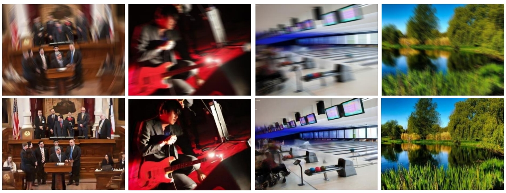
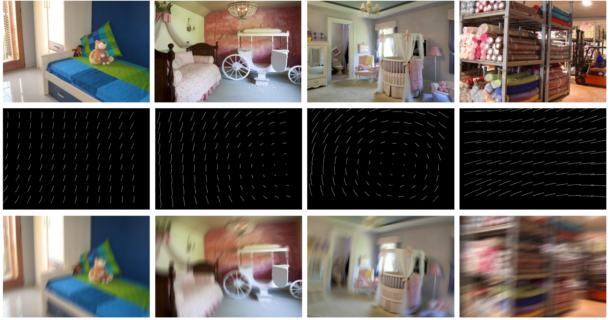
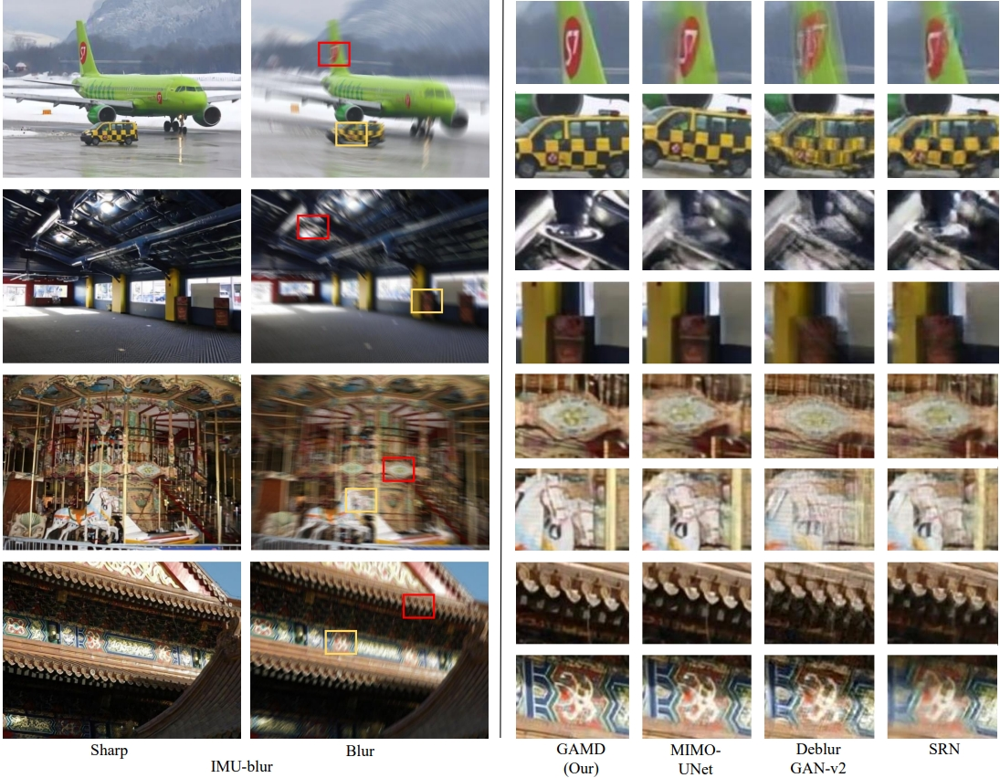

# Gyroscope-Aided Motion Deblurring with Deep Networks
by Simin Luan, [Cong Yang](https://cong-yang.github.io/), Xue Qing, ([pdf](http://www.))

### Our results on Blur-IMU


### Synthetic blurred image


### Comparison of different methods


## Composite blurred image

### Prerequisites
- Python2.7
- Scipy
- Pandas
- OS
- math
- opencv

### Installation
Clone this project to your machine. 

```
git clone https://github.com/lsmlovefm/GAMD-Net.git
cd Image_blur
```

### Process
Download blurred image metadata from [dataset](https://drive.google.com/file/d/10inB3MHqycfK1awgBy13lNNyj1L8amvY/view?usp=drive_link) inside `Imageblur/data`. Then place the image that needs to be blurred into `imageblur/image`. It should be noted that the default image pixels are 740*580. You can use this method to combine clear images in Realblur and GoPro into blurry images.

```
Imageblur
├─ Imageblur
│ ├─ blur    % blurred image
│ │ ├─ xxxx.jpg
│ │ ├─ ......
│ │
│ ├─ image % raw image
│ │ ├─ xxxx.jpg
│ │ ├─ ......
│
│ ├─ data % download from [this](https://drive.google.com/file/d/10inB3MHqycfK1awgBy13lNNyj1L8amvY/view?usp=drive_link)
```

```python imageblur/imageblur.py```


## GAMD network

### Prerequisites
- Python
- Pytorch (1.4)
- scikit-image
- opencv-python
- Tensorboard

### Installation
Clone this project to your machine. 

```bash
git clone https://github.com/lsmlovefm/GAMD-Net.git
cd GAMD
```

### Process
Download blurred image metadata from [IMU-blur](https://drive.google.com/file/d/1r8jfZrPxSlMGstCMiwcVlP5xVGUg_VLi/view?usp=drive_link) inside `GAMD/`.
```
GAMD
├─ trainingset
│ ├─ train
│ │ ├─ blur    % 6680 image pairs
│ │ │ ├─ xxxx.png
│ │ │ ├─ ......
│ │ │
│ │ ├─ sharp
│ │ │ ├─ xxxx.png
│ │ │ ├─ ......
│ │ 
│ │ ├─ cp % control point heatmap
│ │ │ ├─ xxxx.png
│ │ │ ├─ ......
│ │
│ │ ├─ ep % endpoint heatmap
│ │ │ ├─ xxxx.png
│ │ │ ├─ ......
│ │
│ ├─ test    % 1670 image pairs
│ │ ├─ ...... (same as train)
```

## Train

Train GAMD, run the command below:

``` python main.py --mode "train" --data_dir "training_set" ```

Model weights will be saved in ``` results/model_name/weights``` folder.


## Test

Test GAMD , run the command below:

```python main.py --mode "test" --data dir "training_set" --test_model "best.pkl" ```


If you have a GPU, please include `--gpu` argument, and add your gpu id to your command. 
Otherwise, use `--gpu=-1` for CPU. 

```bash
python main.py --mode "test" --data dir "training_set" --test_model "best.pkl" --gpu 1
```

